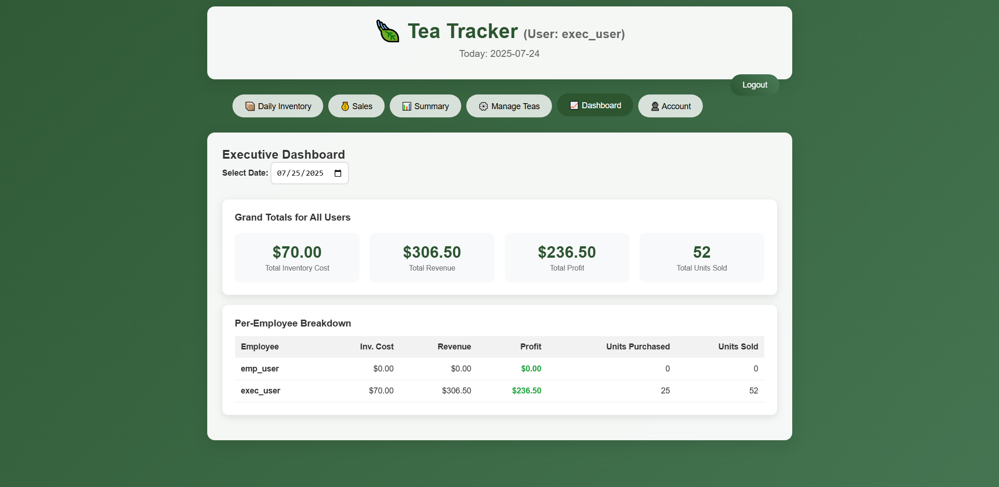
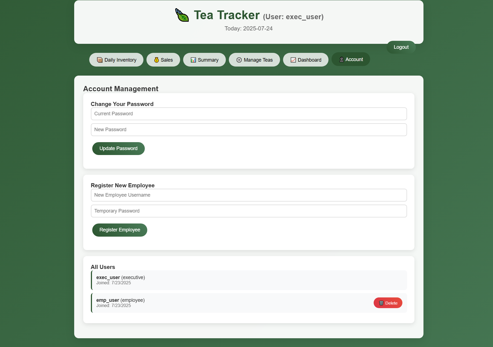

# Tea Tracker 🍃


A full-stack, containerized inventory and sales management application designed for a small tea business. This project was built from the ground up, focusing on a professional development workflow, a secure server architecture, and a modern API-driven design.

***

### Feature Showcase

#### Executive Dashboard
The executive dashboard provides a consolidated, at-a-glance overview of all user activity for a selected date, including grand totals for cost, revenue, and profit.



***

#### User & Account Management
The executive role also includes a dedicated account management panel for creating new employee users, deleting existing users, and managing passwords.



### Abstract

This project is more than just a simple CRUD application; it's a demonstration of building and debugging a complete web service on a production-style, containerized LAMP stack. I handled everything from the initial Docker environment configuration and automated database migrations to architecting a secure, role-based, API-driven backend and connecting it to a dynamic JavaScript front-end. The process involved systematic diagnostics, adherence to security best practices, and a deep dive into the interplay between the container services, the database, and the application code.

### Key Features

-   **Multi-User Authentication & Roledulysses2019/first-contributionss:** A complete login system with two distinct user roles: `employee` and `executive`.
-   **Role-Based Authorization:** Employees can only view and manage their own daily data. Executives have a complete overview of all user activity.
-   **Executive Dashboard:** A dedicated, executive-only reporting view that provides a consolidated summary of all costs, revenue, and profit, with a per-employee breakdown for any given day.
-   **Daily Inventory Management:** Easily set up the day's starting inventory for each tea product. Data is scoped per user.
-   **Real-time Sales Terminal:** An efficient interface for recording sales, which automatically decrements the correct user's stock.
-   **Product & User Management (CRUD):** A dedicated interface for executives to add, edit, and delete tea products from the catalog, as well as create and delete employee accounts.

### Technology Stack

-   **Backend:** PHP 8.1, MySQL 8.0, Apache2
-   **Frontend:** Vanilla JavaScript (ES6+), HTML5, CSS3
-   **Containerization:** Docker, Docker Compose

### Architectural Concepts & Skills Demonstrated

This project was an opportunity to implement and master several key architectural concepts:

-   **API-Driven Design (Separation of Concerns):** I architected the application with a clear separation between the backend and frontend. The PHP backend serves as a pure API, exposing data as JSON endpoints. The frontend is a standalone JavaScript application that consumes this API, allowing for a clean and scalable codebase.

-   **Containerization with Docker:** The entire LAMP stack is defined in a `docker-compose.yml` file, ensuring a consistent, portable, and isolated development environment that perfectly mirrors a modern production setup.

-   **Automated Environment Setup:** An `entrypoint.sh` script automates the setup process by waiting for the database to be ready and then running all necessary SQL migrations, enabling a "one-command" startup for new developers.

-   **Systematic Diagnostics & Debugging:** I honed a systematic approach to debugging. From diagnosing `500 Internal Server Errors` by inspecting container logs and network responses to fixing JavaScript race conditions, I learned to treat every error as a precise signal and work through the stack logically to find the root cause.

-   **Secure by Design:** The application implements role-based access control on all relevant API endpoints, uses secure password hashing, and manages secrets (like database passwords) outside of version control using a `.env` file.

### Getting Started (Local Installation)

These instructions will guide you through setting up and running the project using Docker.

#### Prerequisites

-   [Docker](https://www.docker.com/get-started)
-   [Docker Compose](https://docs.docker.com/compose/install/)

#### 1. Clone the Repository

```bash
git clone https://github.com/your-username/tea-tracker.git
cd tea-tracker
```

#### 2. Configure Environment Variables

The application uses a `.env` file for configuration. An example is provided.

```bash
# Copy the example file to create your own local configuration
cp .env.example .env
```
You can modify the passwords in the `.env` file if you wish, but it will work out of the box with the defaults.

#### 3. Build and Run the Application

This single command will build the custom PHP/Apache image, start all services, and run the database migrations automatically.

```bash
docker-compose up --build -d
```
*   `--build`: Forces Docker to build the image from your `Dockerfile`.
*   `-d`: Runs the containers in the background (detached mode).

#### 4. Seed the Database with Default Users

The migrations create the tables, but a seeder script populates them with the default `exec_user` and `emp_user`. Run this command to execute the seeder inside the running `web` container:

```bash
docker-compose exec web php seed_database.php
```

#### 5. Access the Application

Wait about 30 seconds for the services to initialize. Then, navigate to the following URL in your web browser:

**http://localhost:8080**

### Usage

You can log in with the following default credentials:

-   **Executive Account:**
    -   Username: `exec_user`
    -   Password: `TeaTime$2025!`
-   **Employee Account:**
    -   Username: `emp_user`
    -   Password: `TeaTime$2025!`

### API Endpoints

The frontend communicates with the backend via the following RESTful API endpoints:

| Method | Endpoint                             | Description                                          | Access      |
| :----- | :----------------------------------- | :--------------------------------------------------- | :---------- |
| `POST` | `/api/login.php`                     | Authenticates a user and creates a session.          | Public      |
| `POST` | `/api/logout.php`                    | Destroys the user session.                           | Authenticated |
| `GET`  | `/api/products.php`                  | Fetches a list of all active tea products.           | Authenticated |
| `POST` | `/api/add_product.php`               | Adds a new tea product to the catalog.               | Authenticated |
| `POST` | `/api/update_product.php?id={id}`    | Updates an existing tea product.                     | Authenticated |
| `DELETE`| `/api/delete_product.php`            | Deletes a tea product from the catalog.              | Authenticated |
| `GET`  | `/api/inventory.php?date=YYYY-MM-DD` | Fetches inventory status for the user on a given date. | Authenticated |
| `POST` | `/api/inventory.php`                 | Creates or updates inventory for the user.           | Authenticated |
| `DELETE`| `/api/reset_inventory.php`           | Deletes all inventory for the user on a given date.  | Authenticated |
| `POST` | `/api/sales.php`                     | Records a new sale for the user.                     | Authenticated |
| `GET`  | `/api/summary.php?date=YYYY-MM-DD`   | Fetches a calculated summary for the user.           | Authenticated |
| `GET`  | `/api/users.php`                     | Fetches a list of all users.                         | Executive   |
| `POST` | `/api/register.php`                  | Registers a new employee account.                    | Executive   |
| `DELETE`| `/api/delete_user.php`               | Deletes a user and all their associated data.        | Executive   |
| `GET`  | `/api/executive_report.php`          | Fetches a consolidated report of all user activity.  | Executive   |

***

### License

This project is licensed under the MIT License. See the `LICENSE` file for details.